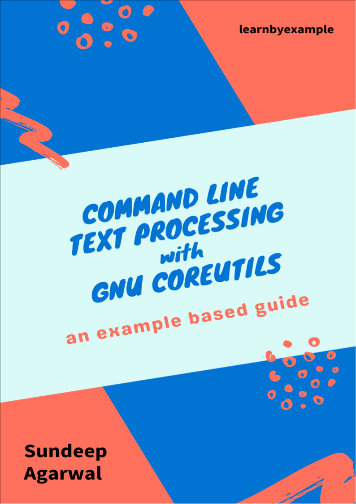

# Command line text processing with GNU Coreutils

⚠️ ⚠️ ⚠️ This is a **work-in-progress** book on command line text processing with GNU Coreutils.

 

You might be already aware of popular coreutils commands like `head`, `tail`, `tr`, `sort`, etc. This book will teach you more than twenty of such specialized text processing tools provided by the `GNU coreutils` package.

My [Command Line Text Processing](https://github.com/learnbyexample/Command-line-text-processing) repo includes chapters on some of these coreutils commands. Those chapters have been significantly edited for this book and new chapters have been added to cover more commands.

    

See [Version_changes.md](./Version_changes.md) to keep track of changes made to the book.

 

# E-book

TODO: pdf/epub versions

For web version of the book, visit https://learnbyexample.github.io/cli_text_processing_coreutils/

See https://learnbyexample.github.io/books/ for list of other books

 

# Feedback and Contributing

[Open an issue](https://github.com/learnbyexample/cli_text_processing_coreutils/issues) if you spot any typo/errors.

:warning: :warning: Please DO NOT submit pull requests. Main reason being any modification requires changes in multiple places.

I'd also highly appreciate your feedback about the book.

Twitter: https://twitter.com/learn_byexample

 

## Acknowledgements

* [/r/commandline/](https://www.reddit.com/r/commandline), [/r/linux4noobs/](https://www.reddit.com/r/linux4noobs/) and [/r/linux/](https://www.reddit.com/r/linux/) — helpful forums
* [stackoverflow](https://stackoverflow.com/) and [unix.stackexchange](https://unix.stackexchange.com/) — for getting answers on pertinent questions related to cli tools
* [canva](https://www.canva.com/) — cover image
* [Warning](https://commons.wikimedia.org/wiki/File:Warning_icon.svg) and [Info](https://commons.wikimedia.org/wiki/File:Info_icon_002.svg) icons by [Amada44](https://commons.wikimedia.org/wiki/User:Amada44) under public domain
* [pngquant](https://pngquant.org/) and [svgcleaner](https://github.com/RazrFalcon/svgcleaner) for optimizing images
* [Inkscape](https://inkscape.org/) for favicon
* [mdBook](https://github.com/rust-lang/mdBook) — for web version of the book
    * [mdBook-pagetoc](https://github.com/JorelAli/mdBook-pagetoc) — for adding table of contents for each page
    * [minify-html](https://github.com/wilsonzlin/minify-html) — for minifying html files

 

## License

The book is licensed under a [Creative Commons Attribution-NonCommercial-ShareAlike 4.0 International License](https://creativecommons.org/licenses/by-nc-sa/4.0/)

The code snippets are licensed under MIT, see [LICENSE](./LICENSE) file

