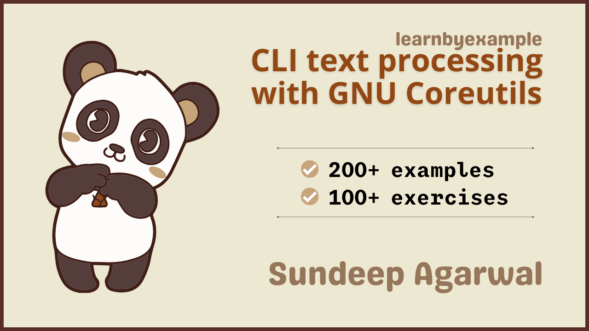

# CLI text processing with GNU Coreutils

You might be already aware of popular coreutils commands like `head`, `tail`, `tr`, `sort` and so on. This book will teach you more than twenty of such specialized text processing tools provided by the `GNU coreutils` package. Visit https://youtu.be/oCnJLu_PUbY for a short video about the book.

The book also includes exercises to test your understanding, which are presented together as a single file in this repo — [Exercises.md](./exercises/Exercises.md).

For solutions to the exercises, see [Exercise_solutions.md](./exercises/Exercise_solutions.md).

See [Version_changes.md](./Version_changes.md) to keep track of changes made to the book.

 

# E-book

* You can purchase the pdf/epub versions of the book using these links:
    * https://learnbyexample.gumroad.com/l/cli_coreutils
    * https://leanpub.com/cli_coreutils
* You can also get the book as part of these bundles:
    * **Linux CLI Text Processing** bundle from https://learnbyexample.gumroad.com/l/linux-cli-text-processing or https://leanpub.com/b/linux-cli-text-processing
    * **All books bundle** bundle from https://learnbyexample.gumroad.com/l/all-books
        * Includes all my programming books
* See https://learnbyexample.github.io/books/ for a list of other books

For a preview of the book, see [sample chapters](./sample_chapters/cli_text_processing_coreutils_sample.pdf).

The book can also be [viewed as a single markdown file in this repo](./cli_text_processing_coreutils.md). See my blogpost on [generating pdfs from markdown using pandoc](https://learnbyexample.github.io/customizing-pandoc/) if you are interested in the ebook creation process.

For web version of the book, visit https://learnbyexample.github.io/cli_text_processing_coreutils/

 

# Testimonials

>In my opinion the book does a great job of quickly presenting examples of how commands can be used and then paired up to achieve new or interesting ways of manipulating data. Throughout the text there are little highlights offering tips on extra functionality or limitations of certain commands. For instance, when discussing the *shuf* command we're warned that *shuf* will not work with multiple files. However, we can merge multiple files together (using the *cat* command) and then pass them to *shuf*. These little gems of wisdom add a dimension to the book and will likely save the reader some time wondering why their scripts are not working as expected.
>
> — book review by Jesse Smith on [distrowatch.com](https://distrowatch.com/weekly.php?issue=20211206#book)

>I discovered your books recently and they’re awesome, thank you! As a 20 year *nix they made me realize how much more there are to these rock solid and ancient tools, once you spend the time to actually learn the intricacies of them.
>
> — feedback on [reddit](https://old.reddit.com/r/commandline/comments/1byumd6/learn_gnu_coreutils_text_processing_tools_like/l2pk5bd/)

 

# Feedback

⚠️ ⚠️ Please DO NOT submit pull requests. Main reason being any modification requires changes in multiple places.

I would highly appreciate it if you'd let me know how you felt about this book. It could be anything from a simple thank you, pointing out a typo, mistakes in code snippets, which aspects of the book worked for you (or didn't!) and so on. Reader feedback is essential and especially so for self-published authors.

You can reach me via:

* Issue Manager: [https://github.com/learnbyexample/cli_text_processing_coreutils/issues](https://github.com/learnbyexample/cli_text_processing_coreutils/issues)
* E-mail: `echo 'bGVhcm5ieWV4YW1wbGUubmV0QGdtYWlsLmNvbQo=' | base64 --decode`
* Twitter: [https://twitter.com/learn_byexample](https://twitter.com/learn_byexample)

 

# Table of Contents

1) Preface
2) Introduction
3) cat and tac
4) head and tail
5) tr
6) cut
7) seq
8) shuf
9) paste
10) pr
11) fold and fmt
12) sort
13) uniq
14) comm
15) join
16) nl
17) wc
18) split
19) csplit
20) expand and unexpand
21) basename and dirname
22) What next?

 

# Acknowledgements

* [GNU coreutils documentation](https://www.gnu.org/software/coreutils/manual/coreutils.html) — manual and examples
* [/r/commandline/](https://old.reddit.com/r/commandline), [/r/linux4noobs/](https://old.reddit.com/r/linux4noobs/) and [/r/linux/](https://old.reddit.com/r/linux/) — helpful forums
* [stackoverflow](https://stackoverflow.com/) and [unix.stackexchange](https://unix.stackexchange.com/) — for getting answers to pertinent questions on coreutils and related commands
* [tex.stackexchange](https://tex.stackexchange.com/) — for help on [pandoc](https://github.com/jgm/pandoc/) and `tex` related questions
* [canva](https://www.canva.com/) — cover image
* [Warning](https://commons.wikimedia.org/wiki/File:Warning_icon.svg) and [Info](https://commons.wikimedia.org/wiki/File:Info_icon_002.svg) icons by [Amada44](https://commons.wikimedia.org/wiki/User:Amada44) under public domain
* [oxipng](https://github.com/shssoichiro/oxipng), [pngquant](https://pngquant.org/) and [svgcleaner](https://github.com/RazrFalcon/svgcleaner) — optimizing images
* [SpikePy](https://github.com/SpikePy) — for spotting an ambiguous explanation
* [mdBook](https://github.com/rust-lang/mdBook) — for web version of the book
    * [mdBook-pagetoc](https://github.com/JorelAli/mdBook-pagetoc) — for adding table of contents for each page
    * [minify-html](https://github.com/wilsonzlin/minify-html) — for minifying html files

 

# License

The book is licensed under a [Creative Commons Attribution-NonCommercial-ShareAlike 4.0 International License](https://creativecommons.org/licenses/by-nc-sa/4.0/).

The code snippets are licensed under MIT, see [LICENSE](./LICENSE) file.

